# Goku Chat 

Goku Chat es una Single Page Application (SPA) donde el usuario puede conversar con Goku en una interfaz inspirada en el anime Dragon Ball Z.

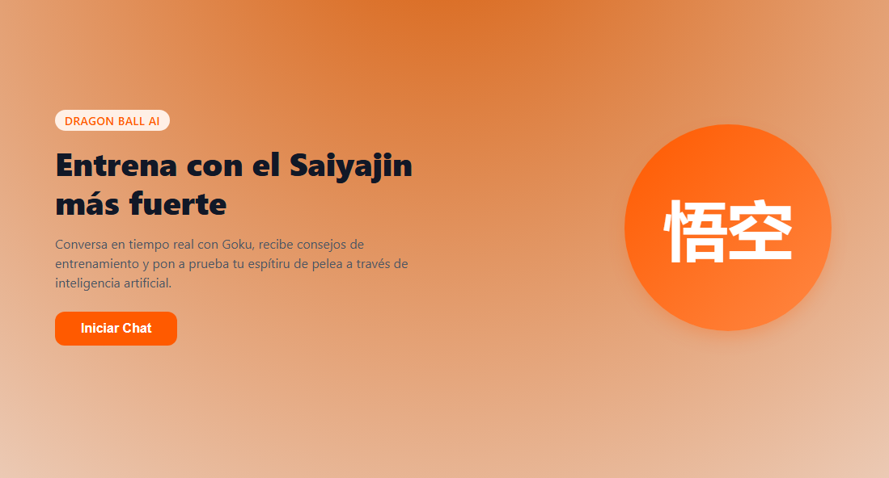

La aplicación fue construida con HTML, CSS y JavaScript, con enfoque mobile-first, usando History API para la navegación entre vistas, una Serverless Function en Vercel para comunicarse de forma segura con Gemini, y Vitest para pruebas unitarias.

## Qué hace este proyecto

Este proyecto permite:

- Navegar entre las vistas Home, Chat y About sin recargar la página.
- Conversar con Goku desde una interfaz de chat.
- Mantener el contexto de la conversación durante la sesión.
- Usar Gemini desde el backend sin exponer la API key en el frontend.
- Mostrar estados de carga y error en el chat.
- Ejecutarse localmente y también en producción con Vercel.

## Despliegue 
El proyecto está desplegado en Vercel.
🔗 [Ver aplicación desplegada](https://proyecto-m3-luna-marcos-v7kt.vercel.app/)


## Tecnologías usadas

- HTML
- CSS
- JavaScript
- History API
- Vercel Serverless Functions
- Google Gemini API
- Vitest

## Cómo ejecutar el proyecto localmente

1. Clonar el repositorio
```bash
   git clone https://github.com/MarcosLuna87-Dev/ProyectoM3_LunaMarcos.git
cd ProyectoM3_LunaMarcos
```
2. Instalar dependencias
```bash
   npm install
```
3. Crear el archivo .env
```bash
   GEMINI_API_KEY=Aqui.tienes.que.colocar.tu.APIKEY
```
Si no tienes una API key puedes usar .env.example como referencia

## Cómo levantar el proyecto
Para el desarrollo local con Vercel:
```bash
vercel dev
```
Luego abre en el navegador:
```bash
http://localhost:3000
```
## Cómo ejecutar los tests
```bash
npm test
```
los tests verifican funciones puras y transformación de respuestas de la API.

## Vistas Principales

### Home
Muestra la bienvenida al proyecto y permite navegar al chat o a la información general.

### Home
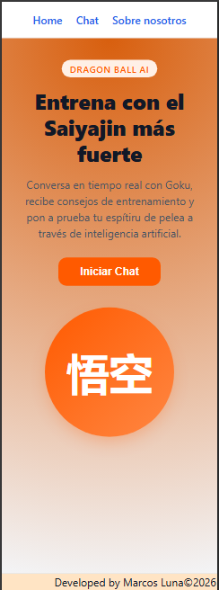

### Chat
Permite conversar con Goku de Dragon Ball Z, ver respuestas, mantener un historial en sesión y visualizar estados de carga o error.

### Chat vacío

### Chat con conversación
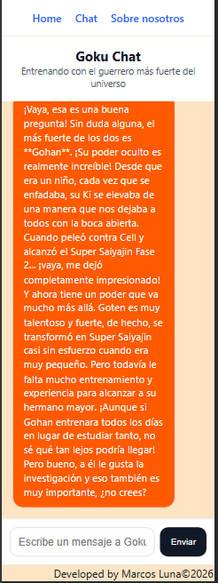


### About
Explica de forma breve el propósito del proyecto y las tecnologías utilizadas.

### About
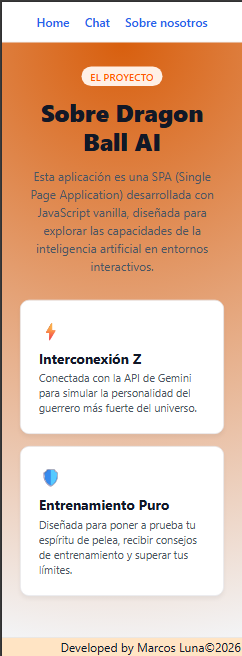

## Cómo funciona el chat 
1. El usuario escribe un mensaje en la vista chat.
2. El frontend envía el historial completo a /api/gokuChat.
3. La Serverless Function usa la API key desde el backend.
4. Gemini genera una respuesta con el estilo de Goku.
5. La respuesta vuelve al frontend y se muestra en pantalla.

## Seguridad
La API key no está expuesta en el cliente.
La comunicación con Gemini se hace desde una Serverless Function en:
```bash
/api/gokuChat
```
Las variables de entorno se manejan con .env en local y desde el panel de Vercel en producción.

## Tests Implementados
Actualmente el proyecto incluye pruebas unitarias y de entorno con Vitest para:

- Enrutamiento e Intercepción de Navegación (History API): Validación de cambios de estado en el historial, renderizado de vistas según el pathname (home y notFound) y control de captura de eventos en clicks locales sin recarga de página.
- Ciclo de Vida y Estados de la Interfaz (DOM/UI): Verificación de transiciones dinámicas entre los estados de carga (loading) y pantalla vacía (empty) manejadas por temporizadores asíncronos.
- Interacción del Usuario y Envío de Datos: Captura y simulación de envío de formularios de chat, asegurando la lectura correcta de los campos de entrada y la persistencia de datos en el DOM.
- Estructuración y Formateo del Historial: Validación de la carga automática del historial de conversación y su conversión al formato de mensajes estructurados requerido por el modelo.
- Funciones de Servidor Seguras (Serverless Functions): Pruebas de integración simuladas para la API local de Vercel, asegurando la restricción de métodos HTTP (POST), el control de variables de entorno de la API Key y la correcta transformación de payloads hacia la API externa de Gemini.
## Sobre el uso de IA

### Primer Prompt
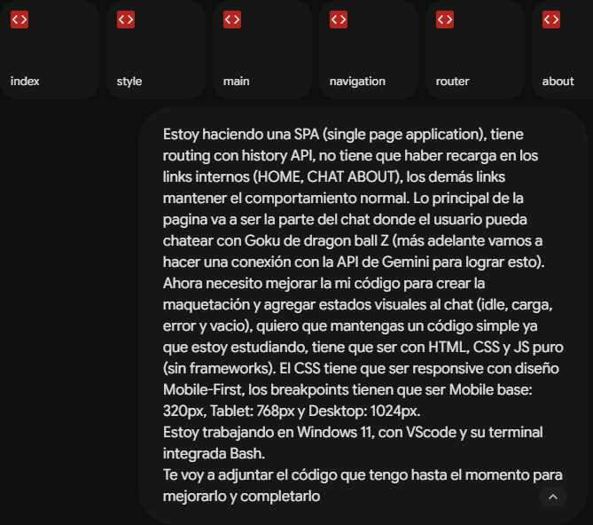
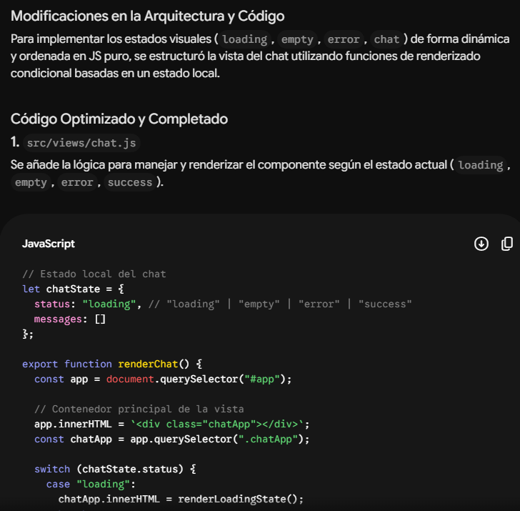

### Segundo Prompt
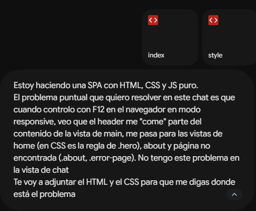
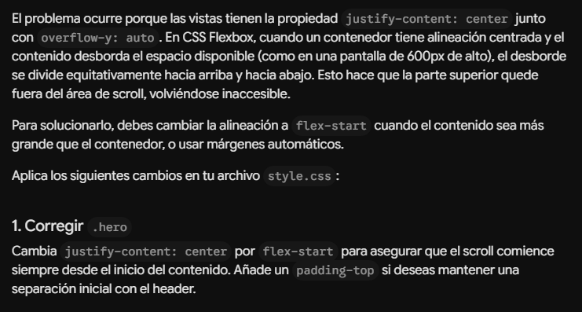

### Tercer Prompt
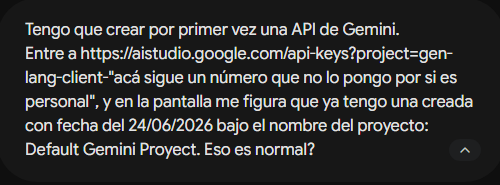
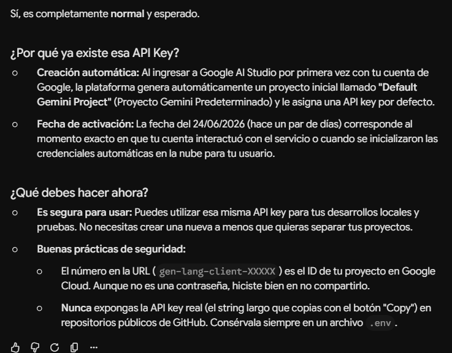


### Cuarto Prompt
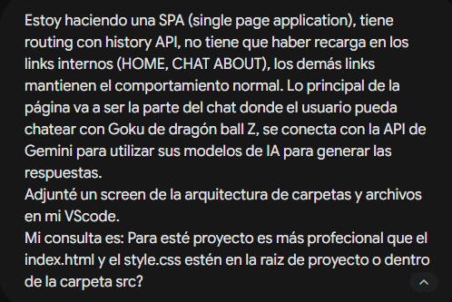
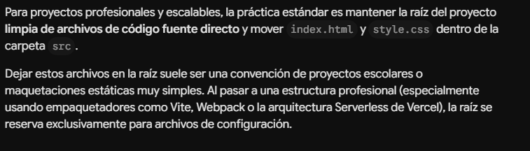


## Autor
Marcos Luna 
